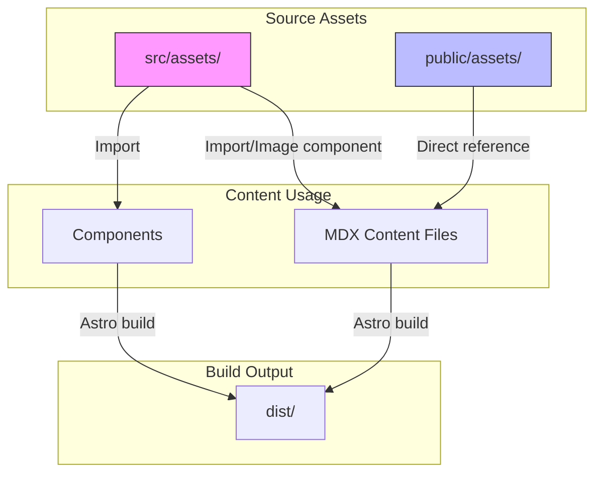

# Content Optimization Analysis for Astro Starlight Project

## Project Overview
- **Framework**: Astro + Starlight
- **Type**: Multilingual documentation/personal site (SL/EN/HR)
- **Locales**: 3 (Slovenian root, English, Croatian)
- **Build Output**: Static

---

## Identified Optimization Opportunities

### 1. Duplicate Assets (Critical - Build Size Impact)

Several files exist in BOTH `src/assets/` and `public/assets/`, causing unnecessary duplication:

| File | src/assets | public/assets | Recommendation |
|------|------------|---------------|----------------|
| 3v-dome-9m.blend | ✓ | ✓ | Keep in public/ (download link) |
| docker-compose-up.png | ✓ | ✓ | Keep in src/ (Lightbox component) |
| geometry-nodes.blend | ✓ | ✓ | Keep in public/ (download link) |
| Icosphere.png | ✓ | ✓ | Keep in src/ (Lightbox component) |
| ollama-dolphin-terminal-chat.png | ✓ | ✓ | Keep in src/ (Lightbox component) |
| siel.png | ✓ | ✓ | Keep in src/ (Lightbox component) |

**Impact**: Each duplicate increases build output size.

**Current Usage**:
- Files in `src/assets/` are imported in components (get optimized by Sharp)
- Files in `public/assets/` are linked directly via `<a href="/assets/...">` for downloads

**Optimization Strategy**:
- Keep Blender `.blend` files ONLY in `public/assets/` (used for download links)
- Keep image files ONLY in `src/assets/` (used with `Lightbox` component for optimization)
- Reference: `src/content/docs/cv/tech-skills/index.mdx:89-90` uses `/assets/` path for downloads

---

### 2. Content Consistency Issues (Medium Priority)

#### Personal Qualities Page Content Gap
- **SL version**: Comprehensive content (~500 words) covering technical background, OS preferences, hobbies
- **EN version**: Minimal content (~100 words) - missing technical details, background story
- **HR version**: Not examined but likely similar gap

**Recommendation**: Synchronize content across all languages or add `i18n.untranslatedContent` handling.

---

### 3. Image Import Pattern Optimization (Low Priority)

**Current Pattern** (repeated across 3 files):
```typescript
// src/content/docs/{locale}/cv/tech-skills/index.mdx
import Lightbox from '~/components/Lightbox.astro';
import terminalChat from '~/assets/ollama-dolphin-terminal-chat.png';
import dnsExample from '~/assets/siel.png';
// ... 14 more imports
```

**Optimization Options**:

#### Option A: Shared Image Registry Component (Recommended)
Create `src/components/ImageRegistry.astro`:
```astro
---
import terminalChat from '~/assets/ollama-dolphin-terminal-chat.png';
import dnsExample from '~/assets/siel.png';
// ... all image imports

export const images = {
  terminalChat,
  dnsExample,
  // ...
};
---
```

Then import in content:
```astro
import { images } from '~/components/ImageRegistry.astro';
```

**Benefits**:
- Single source of truth for image assets
- Easier maintenance when adding/removing images
- Reduced duplication across locale files

#### Option B: Content Collections with Schema
Define image relationships in frontmatter schema and load dynamically.

---

### 4. Asset Naming Convention (Low Priority)

**Current Issues**:
- Mixed naming: `Screenshot_20251020_154352.png` vs `windsurf-editor.png`
- Underscores vs hyphens inconsistency

**Recommendation**: Standardize on kebab-case:
```
Screenshot_20251020_154352.png → screenshot-2025-10-20-154352.png
```

---

### 5. Unused Assets (Needs Verification)

The following assets in `src/assets/` may be unused (need verification):

| Asset | Status |
|-------|--------|
| bad-cert.png | Verify usage |
| docker-compose-anythingllm.png | Verify usage |
| docker-desktop-4.48.0.png | Verify usage |
| docker-log-anythingllm.png | Verify usage |
| docker-utilization-htop.png | Verify usage |
| gemma3-letter-count-pass.png | Verify usage |
| houston.webp | Starlight default? |
| nezadovoljivi-odgovori.png | Verify usage |
| ollama-settings-onboarding.png | Verify usage |
| ollama-utilization-htop.png | Verify usage |

---

### 6. Public Assets Optimization

Files in `public/assets/` that could move to `src/assets/` for optimization:

| File | Current Location | Should Move |
|------|------------------|-------------|
| ai-guide-for-thinking-humans.png | public/ | Yes - if used inline |
| blender-dome-geometry-nodes.png | public/ | Yes - if used inline |
| blender-dome-geometry.png | public/ | Yes - if used inline |
| Infrastructure-as-code.webp | public/ | Yes - if used inline |

Files that should STAY in `public/`:
- `.blend` files (download links)
- Images referenced by external URLs

---

### 7. i18n Translation Completeness

**Current State**:
- `sl.json`: Complete UI translations
- `en.json`: Complete UI translations
- `hr.json`: Not examined

**Recommendation**: Verify all three i18n files have consistent key coverage.

---

## Implementation Priority

### Phase 1: Asset Deduplication (High Impact)
1. Remove duplicate `.blend` files from `src/assets/`
2. Remove duplicate images from `public/assets/` that are in `src/assets/`
3. Update any hardcoded references

### Phase 2: Content Consistency (Medium Impact)
1. Align personal-qualities content across languages
2. Verify HR translations are complete

### Phase 3: Code Organization (Low Impact)
1. Consider ImageRegistry component for shared imports
2. Standardize asset naming conventions

### Phase 4: Cleanup (Low Impact)
1. Remove unused assets after verification
2. Optimize remaining public/ assets

---

## Expected Benefits

| Optimization | Build Size | Maintenance | Performance |
|--------------|------------|-------------|-------------|
| Asset deduplication | ✓ Significant | ✓ | ✓ |
| Image registry | - | ✓ Significant | - |
| Naming convention | - | ✓ | - |
| Unused asset removal | ✓ | ✓ | ✓ |

---

## Diagram: Current Asset Flow



## Diagram: Proposed Optimized Flow

```mermaid
flowchart TD
    subgraph "Source Assets"
        SA[src/assets/]<br/>Images only
        PA[public/assets/]<br/>Downloads only
    end

    subgraph "Content Usage"
        MDX[MDX Content Files]
        REG[ImageRegistry.astro]
    end

    subgraph "Build Output"
        DIST[dist/]<br/>Optimized + Smaller]
    end

    SA -->|Import via registry| MDX
    PA -->|Direct link| MDX
    REG -->|Centralized imports| MDX
    MDX -->|Astro build| DIST

    style SA fill:#f9f,stroke:#333
    style PA fill:#bbf,stroke:#333
    style REG fill:#ff9,stroke:#333
```
